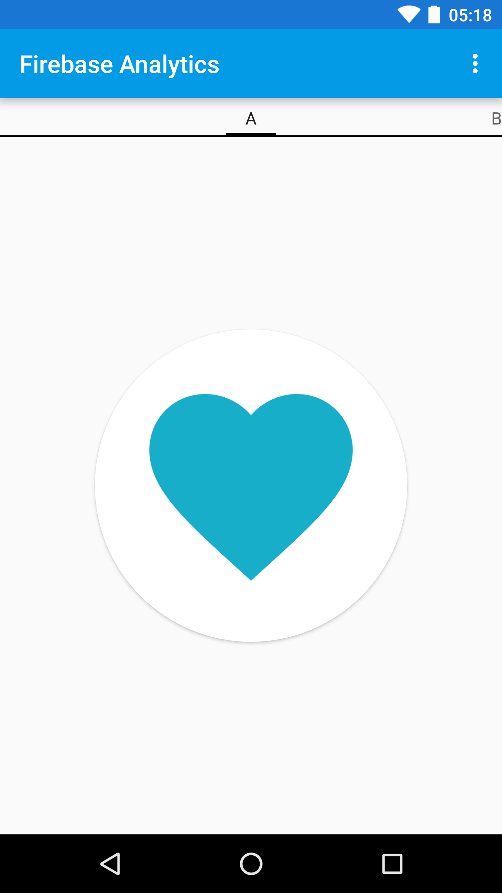

# AWS Pinpoint for AWS Amplify Quickstart

This is a fork of the [Firebase Analytics Sample](https://github.com/firebase/quickstart-android/tree/master/analytics). 
It demonstrates how you can also achieve mobile analytics with [AWS Amplify](https://aws-amplify.github.io/)
using [AWS Pinpoint](https://aws.amazon.com/pinpoint/).

Please Ignore the Firebase packages lol.

## Getting Started

Before we can get started, you need a few things like the Amplify CLI and Android studio.
I'll detail them here.

### Prerequisites

Make sure you have the following:

* Nodejs 12+
* Android Studio 3.1+
* Android SDK API Level 15+
* JRE 1.8+
* An [AWS Account](https://aws.amazon.com/free/)


### Installing

First let's get the Amplify CLI like so

```
npm install -g @aws-amplify/cli
amplify configure
```

After that's done, we need to initialise the project

```
git clone https://github.com/windlessuser/AWS-Amplify-Pinpoint-Android-Quickstart.git
cd AWS-Amplify-Pinpoint-Android-Quickstart
amplify init
```

After the Project is Initialised, we then add analytics

```
amplify add analytics
amplify push
```

With that, you should be able to compile the Project and run it on an emulator or a device.


Result
-----------
After running the app you should see a screen like this:



The first time you run the app you will be asked what your
favorite food is. This choice will be logged to Pinpoint
Analytics as an [Event](https://docs.aws.amazon.com/pinpoint/latest/apireference/apps-application-id-events.html).

As you swipe between tabs in the app, `SELECT_CONTENT` events 
are logged to Pinpoint. You can see these events in
real time using amplify like so:

```
amplify console analytics
```

Then you click on `Events` in the menu on the left.

## Authors
* **All the Firebase Android Quickstart Contributors**
* **Marc Byfield** - *Made the Conversion to Amplify* - [SaaSBooster](https://twitter.com/saasbooster)

## License

This project uses the Same Apache License Version 2 as the original repository. 

## Acknowledgments

[This leak](https://www.cnbc.com/2019/12/17/google-reportedly-wants-to-be-top-two-player-in-cloud-by-2023.html) was a big bombshell
There are many Startups who placed their bets on Google and Firebase. This was like being caught with your
pants down. 

As such, I've started this initiative to show folks how east it is to get started on Firebase. I'm going to
convert all the [Firebase Samples](https://firebase.google.com/docs/samples) over to AWS Amplify and help
other startups and companies make the switch today. 

If that's you, feel free to hit me up!
